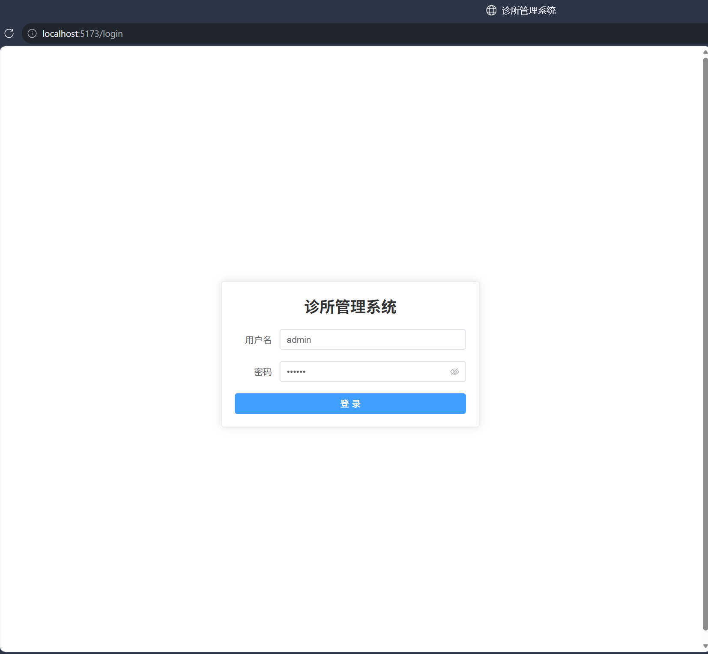
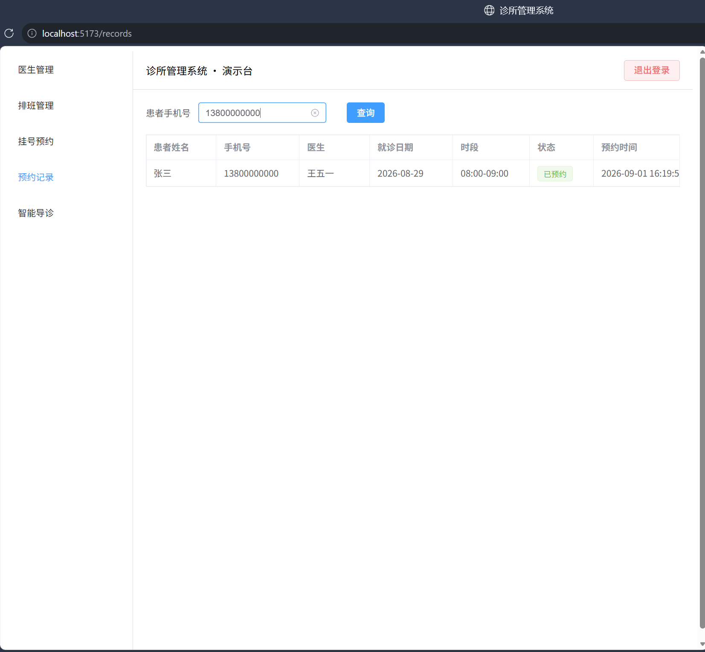
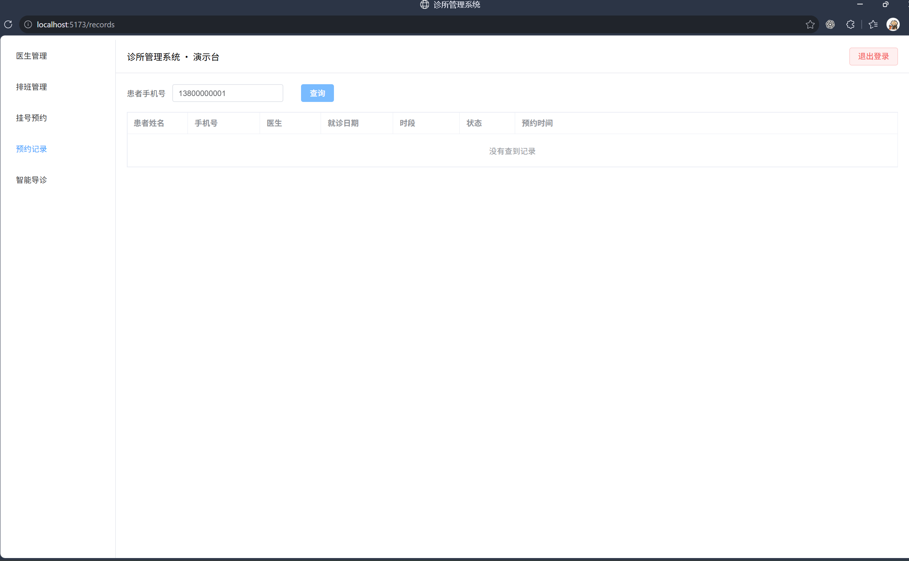

# 诊所管理系统（前端）

医院门诊排班与号源平台的 Web 端。后端为 [clinic-server](https://github.com/Racter-42/clinic-server)（Spring Boot + MyBatis + MySQL + Redis），本仓库只负责页面与交互。

## 页面预览

**登录页**



**预约记录（查到数据）**



**预约记录（查不到数据时的空状态）**



## 功能

左侧五个菜单对应五个页面：

| 菜单 | 页面做的事 |
|---|---|
| 医生管理 | 医生列表 + 各科室在岗人数统计卡片；新增 / 编辑 / 删除。执业证号按 15 位数字校验，编辑时不可修改 |
| 排班管理 | 选医生 + 日期 + 班次（上午 / 下午 / 晚班）新增排班；按科室 + 未来 N 天查询排班，列表带上版本号 |
| 挂号预约 | 第一步按日期分组的号源卡片里选一个（已被约走的置灰不可选），第二步填患者姓名和手机号提交。提交时带一次性防重 token |
| 预约记录 | 导诊台场景：输入患者手机号查他的预约记录，查不到时表格显示空状态；记录超过 10 条时前端分页 |
| 智能导诊 | 输入症状描述，调用 AI 接口返回推荐科室的文案 |

## 技术栈

| 项 | 版本 | 说明 |
|---|---|---|
| Vue | 3.5 | 组合式 API，页面用 `<script setup>` 写 |
| Element Plus | 2.8 | UI 组件库，注册了中文语言包 |

## 本地运行

前提：后端 clinic-server 已启动在 `8080`，且 MySQL / Redis 可用。

```bash
npm install
npm run dev
# 打开 http://localhost:5173
```

演示账号：`admin` / `123456`（登录页已预填，点登录即可）

打包：`npm run build`，产物在 `dist/`。

## 与后端的约定

这几条是前后端对接时的实际约定，改接口时要注意：

| 约定 | 内容 |
|---|---|
| 跨域 | 后端没开 CORS，`vite.config.js` 里按接口前缀配了 dev 代理转发到 8080，浏览器侧始终是同源请求 |
| 鉴权 | 登录成功返回纯字符串 token，存进 localStorage；后续请求放在请求头 `token` 字段（不是 `Authorization`） |
| 响应体 | 标准接口统一 `{ code, message, data }`，`code !== 0` 当业务失败处理；登录和医生增删改成功时直接返回纯字符串 |
| 401 | axios 响应拦截器统一清 token 并跳回登录页 |
| 提交挂号 | 后端用 `@RequestParam` 收参，所以参数走 URL query，不能放 JSON body |

## 目录结构

```
clinic-web/
├─ docs/screenshots/      页面截图
├─ src/
│  ├─ api/                接口封装，request.js 是统一的 axios 实例（拦截器在这里）
│  ├─ router/             路由表 + 登录态守卫
│  ├─ views/
│  │  ├─ Login.vue        登录页
│  │  ├─ Layout.vue       左侧菜单 + 顶栏
│  │  ├─ doctor/          医生管理
│  │  ├─ schedule/        排班管理
│  │  ├─ source/          挂号预约
│  │  ├─ reserve/         预约记录
│  │  └─ recommend/       智能导诊
│  ├─ App.vue
│  └─ main.js
├─ index.html
├─ vite.config.js         代理配置
└─ package.json
```

## 已知限制

- 登录后左侧菜单全量可见，没做角色或权限区分（后端只有单一管理员账号）
- 预约记录是前端分页：接口一次返回该患者的全部记录。单个患者记录量涨上去要改成后端分页
- 前端校验只做必填和格式，业务规则（号源是否还能约、排班是否重复）都以后端返回为准
- 目前只在本地运行，没有线上演示环境；也没有单元测试
